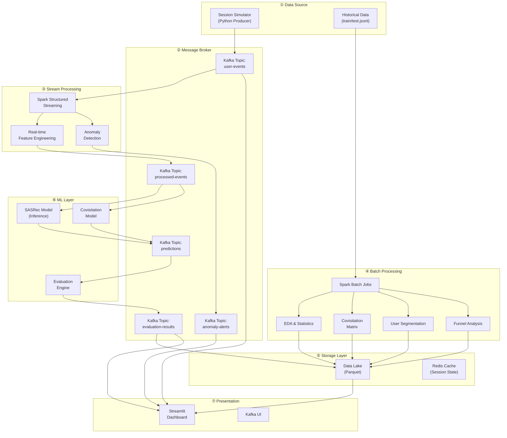

# Pipeline Toàn Diện cho OTTO Recommender System - Bài Tập Lớn Dữ Liệu Lớn

## 1. Tổng Quan & Bối Cảnh

### Dataset OTTO Recommender System
- **12M+ sessions** thực tế, **~220M events** từ webshop OTTO
- **~1.8M sản phẩm** (article IDs)
- **3 loại hành vi**: `clicks`, `carts`, `orders`
- Format: JSONL với cấu trúc `{session, events: [{aid, ts, type}]}`

### Mục tiêu
Xây dựng pipeline **end-to-end** không chỉ giả lập → dự đoán, mà bao gồm **toàn bộ vòng đời dữ liệu** trong một hệ thống Big Data thực tế: thu thập → xử lý → phân tích → mô hình → đánh giá → giám sát.

### Hiện trạng dự án
Dự án đã có sẵn:
- Kafka + Kafka UI (docker-compose)
- Worker framework (aiokafka consumers)
- Config system (YAML + env vars)
- Spark config (commented out nhưng sẵn sàng)
- SASRec model (Streamlit demo)
- EDA & preprocessing code (Spark-based)
- Covisitation matrix computation

---

## 2. Kiến Trúc Hệ Thống Đề Xuất



---

## 3. Các Thành Phần Chi Tiết (8 Modules)

### Module 1: Session Simulator (Kafka Producer) 🎮

**Mục tiêu**: Giả lập luồng dữ liệu người dùng real-time giống thực tế, không chỉ replay đơn thuần.

#### Tính năng:
| # | Tính năng | Mô tả |
|---|-----------|-------|
| 1 | **Replay từ test.jsonl** | Đọc sessions từ file, gửi từng event theo thứ tự timestamp |
| 2 | **Tốc độ điều chỉnh** | Hỗ trợ speed multiplier (1x, 5x, 10x real-time) |
| 3 | **Random Session Generator** | Sinh session ngẫu nhiên dựa trên phân phối thống kê từ dữ liệu thật (session length, event type ratio, inter-event time) |
| 4 | **Scenario Modes** | Normal traffic, Flash sale (spike), Bot traffic (anomaly), Quiet hours |
| 5 | **Multi-user concurrent** | Chạy nhiều sessions song song để giả lập traffic thực |

#### Files:
- `src/simulator/producer.py` — Main producer logic
- `src/simulator/session_generator.py` — Random session generation
- `src/simulator/scenarios.py` — Traffic scenario definitions
- `src/simulator/main.py` — Entry point

---

### Module 2: Spark Structured Streaming (Real-time Processing) ⚡

**Mục tiêu**: Xử lý luồng dữ liệu real-time từ Kafka, tạo features và phát hiện anomaly.

#### Tính năng:
| # | Tính năng | Mô tả |
|---|-----------|-------|
| 1 | **Session State Management** | Maintain sliding window session state (items in current session, cart items, etc.) |
| 2 | **Real-time Feature Engineering** | Tính toán features: session length, click-to-cart ratio, dwell time, recency |
| 3 | **Windowed Aggregation** | Thống kê: events/minute, unique sessions/minute, popular items trong 5 phút |
| 4 | **Event Enrichment** | Gắn thêm metadata: hour_of_day, day_of_week, session_duration |
| 5 | **Write to Kafka output topic** | Push processed events sang `processed-events` topic |

#### Files:
- `src/streaming/spark_streaming_job.py` — Main Spark Structured Streaming job
- `src/streaming/feature_engineering.py` — UDFs và feature transformations
- `src/streaming/session_state.py` — Stateful session tracking logic

---

### Module 3: Batch EDA & Statistics Pipeline (Spark SQL) 📊

**Mục tiêu**: Phân tích dữ liệu lịch sử toàn diện, tạo insights cho báo cáo.

#### 3.1 EDA Cơ Bản (đã có một phần)
| # | Phân tích | Mô tả |
|---|-----------|-------|
| 1 | Event Distribution | Phân bố clicks / carts / orders (bar + pie chart) |
| 2 | Session Length Distribution | Histogram số events/session |
| 3 | Temporal Patterns | Events theo giờ, theo ngày trong tuần |
| 4 | Item Popularity | Long-tail distribution, Pareto analysis |

#### 3.2 Phân Tích Nâng Cao
| # | Phân tích | Mô tả |
|---|-----------|-------|
| 5 | **Funnel Analysis** | Click → Cart → Order conversion rate |
| 6 | **Session Complexity Score** | Phân loại sessions: browse-only, cart-abandoner, buyer |
| 7 | **User Segmentation (K-Means trên Spark)** | Segment users theo hành vi: heavy-browser, quick-buyer, window-shopper |
| 8 | **Item Affinity Analysis** | Items thường xuất hiện cùng nhau (beyond covisitation) |
| 9 | **Time-to-Purchase** | Phân tích thời gian từ click đầu tiên đến order |
| 10 | **Cart Abandonment Rate** | Tỷ lệ bỏ giỏ hàng theo segment |
| 11 | **Repeat Purchase Pattern** | Items được mua lại nhiều lần trong dataset |
| 12 | **Session Bounce Rate** | % sessions chỉ có 1 event |

#### Files:
- `src/batch/eda_advanced.py` — Advanced EDA computations
- `src/batch/funnel_analysis.py` — Conversion funnel
- `src/batch/user_segmentation.py` — K-Means clustering
- `src/batch/item_analysis.py` — Item affinity & popularity

---

### Module 4: Real-time Anomaly Detection 🚨

**Mục tiêu**: Phát hiện hành vi bất thường trong luồng dữ liệu real-time.

#### Tính năng:
| # | Anomaly Type | Logic |
|---|-------------|-------|
| 1 | **Bot Detection** | Sessions với quá nhiều clicks trong thời gian ngắn (>100 events/phút) |
| 2 | **Unusual Cart Behavior** | Thêm vào giỏ >50 items trong 1 session |
| 3 | **Click Fraud** | Click lặp lại cùng item_id liên tục |
| 4 | **Traffic Spike** | Tổng events vượt 3σ so với baseline |
| 5 | **Outlier Session Duration** | Sessions kéo dài bất thường (>24h) hoặc quá ngắn (<1s) |

#### Files:
- `src/streaming/anomaly_detector.py` — Rule-based anomaly detection
- `src/streaming/anomaly_rules.py` — Configurable rules

---

### Module 5: Model Serving & Prediction 🤖

**Mục tiêu**: Nhận processed events → đưa vào model → trả kết quả dự đoán.

#### Tính năng:
| # | Tính năng | Mô tả |
|---|-----------|-------|
| 1 | **SASRec Inference** | Load SASRec checkpoint, predict top-20 items |
| 2 | **Covisitation Baseline** | Dùng covisitation matrix để recommend (không cần GPU) |
| 3 | **Multi-objective Output** | Dự đoán riêng cho clicks, carts, orders |
| 4 | **Prediction Logging** | Lưu mọi prediction kèm timestamp vào Kafka topic `predictions` |
| 5 | **Model A/B Routing** | Switch giữa SASRec và Covisitation để so sánh |

#### Files:
- `src/serving/inference_service.py` — Inference wrapper
- `src/serving/covisitation_recommender.py` — Covisitation baseline
- `src/serving/model_router.py` — A/B model routing logic

---

### Module 6: Evaluation & Metrics Engine 📏

**Mục tiêu**: Đánh giá chất lượng dự đoán theo nhiều chiều, tạo báo cáo tự động.

> [!IMPORTANT]
> Đây là phần quan trọng nhất để **phân biệt** dự án này với "chỉ giả lập rồi dự đoán". Module này tạo ra giá trị phân tích thực sự.

#### 6.1 Offline Evaluation (trên validation set)
| # | Metric | Mô tả |
|---|--------|-------|
| 1 | **Recall@20** | % items đúng trong top-20 predictions (metric chính của Kaggle OTTO) |
| 2 | **MRR@20** | Mean Reciprocal Rank — vị trí của item đúng |
| 3 | **NDCG@20** | Normalized DCG — chất lượng ranking |
| 4 | **Hit Rate@K** | % sessions mà ít nhất 1 prediction đúng |
| 5 | **Precision@K** | Precision tại các K khác nhau (5, 10, 20) |
| 6 | **Weighted Recall** | Recall có trọng số: clicks(0.1), carts(0.3), orders(0.6) — theo OTTO competition |

#### 6.2 Online/Real-time Evaluation
| # | Metric | Mô tả |
|---|--------|-------|
| 7 | **Prediction Latency** | Thời gian từ lúc nhận event đến lúc trả prediction |
| 8 | **Throughput** | Số predictions/giây |
| 9 | **Coverage** | % catalog items xuất hiện trong predictions |
| 10 | **Popularity Bias** | So sánh phân bố items predicted vs actual |
| 11 | **Diversity** | Intra-list diversity của recommendations |

#### 6.3 Model Comparison
| # | So sánh | Mô tả |
|---|---------|-------|
| 12 | **SASRec vs Covisitation** | So sánh 2 approaches trên cùng metrics |
| 13 | **Per-event-type Analysis** | Metrics riêng cho clicks, carts, orders |
| 14 | **Cold-start Performance** | Hiệu suất trên sessions ngắn (1-3 events) vs dài (>10 events) |
| 15 | **Temporal Analysis** | Metrics thay đổi theo thời gian |

#### Files:
- `src/evaluation/metrics.py` — Recall@K, MRR@K, NDCG@K implementations
- `src/evaluation/offline_evaluator.py` — Batch evaluation on validation set
- `src/evaluation/online_evaluator.py` — Real-time evaluation consumer
- `src/evaluation/comparison_report.py` — Model comparison & visualization

---

### Module 7: Data Lake / Storage Layer 💾

**Mục tiêu**: Tổ chức dữ liệu theo layers cho phân tích đa tầng.

```
datasets/
├── raw/                    # Dữ liệu gốc (train.jsonl, test.jsonl)
├── processed/              # Parquet đã xử lý
│   ├── train.parquet
│   ├── test.parquet
│   └── validation.parquet
├── features/               # Feature tables
│   ├── item_features.parquet
│   ├── session_features.parquet
│   └── covisitation/
├── predictions/            # Predictions logged
│   └── predictions_YYYYMMDD.parquet
├── metrics/                # Evaluation results
│   └── eval_report_YYYYMMDD.json
└── eda/                    # EDA outputs
    ├── charts/
    └── statistics/
```

---

### Module 8: Streamlit Monitoring Dashboard 📺

**Mục tiêu**: Dashboard real-time hiển thị toàn bộ hệ thống.

#### Tabs:
| # | Tab | Nội dung |
|---|-----|---------|
| 1 | **📊 EDA Overview** | Charts từ batch EDA: distribution, funnel, temporal patterns |
| 2 | **⚡ Real-time Monitor** | Live events/second, active sessions, popular items (poll Kafka) |
| 3 | **🤖 Prediction Demo** | Chọn session → xem history → xem predictions (đã có cơ bản) |
| 4 | **📏 Model Evaluation** | Metrics comparison table, charts: Recall@K, MRR, NDCG |
| 5 | **🚨 Anomaly Alerts** | Real-time alerts feed từ anomaly detection |
| 6 | **👥 User Segments** | Kết quả clustering, segment profiles |
| 7 | **🔄 A/B Comparison** | So sánh SASRec vs Covisitation side-by-side |
| 8 | **🏗️ System Health** | Kafka lag, Spark job status, prediction latency histogram |

#### Files:
- `streamlit_app.py` — Main app (mở rộng từ file hiện tại)
- `src/dashboard/pages/` — Multi-page Streamlit app
  - `01_eda_overview.py`
  - `02_realtime_monitor.py`
  - `03_prediction_demo.py`
  - `04_model_evaluation.py`
  - `05_anomaly_alerts.py`
  - `06_user_segments.py`
  - `07_ab_comparison.py`
  - `08_system_health.py`

---

## 4. Technology Stack

| Layer | Technology | Lý do |
|-------|-----------|-------|
| **Message Broker** | Apache Kafka (đã có) | Streaming backbone |
| **Stream Processing** | PySpark Structured Streaming | Real-time processing trên Kafka |
| **Batch Processing** | PySpark SQL | Xử lý dữ liệu lớn (220M events) |
| **ML Framework** | PyTorch + PyTorch Lightning | SASRec model (đã có) |
| **Dashboard** | Streamlit | Nhanh, dễ tích hợp Python |
| **Containerization** | Docker Compose (đã có) | Quản lý services |
| **Config** | YAML + dotenv (đã có) | Centralized config |
| **Async Framework** | asyncio + aiokafka (đã có) | Kafka consumers |

---

## 5. Kế Hoạch Triển Khai (Phases)

### Phase 1: Foundation (3-4 ngày) 🏗️
- [ ] Cấu trúc thư mục mới
- [ ] Session Simulator (replay mode + random mode)
- [ ] Thêm Kafka topics mới vào config
- [ ] Enable Spark trong docker-compose

### Phase 2: Stream Processing (3-4 ngày) ⚡
- [ ] Spark Structured Streaming job đọc từ Kafka
- [ ] Real-time feature engineering
- [ ] Anomaly detection rules
- [ ] Write processed events về Kafka

### Phase 3: Batch Analytics (3-4 ngày) 📊
- [ ] Advanced EDA với Spark SQL
- [ ] Funnel analysis
- [ ] User segmentation (K-Means)
- [ ] Item affinity analysis

### Phase 4: Model Serving & Evaluation (3-4 ngày) 🤖📏
- [ ] Inference service (SASRec + Covisitation)
- [ ] Evaluation metrics implementation
- [ ] Offline evaluation trên validation set
- [ ] Model comparison report

### Phase 5: Dashboard & Integration (2-3 ngày) 📺
- [ ] Multi-page Streamlit dashboard
- [ ] Tích hợp real-time monitoring
- [ ] Anomaly alerts display
- [ ] Final system integration testing

---

## 6. Điểm Mạnh của Kiến Trúc Này

| # | Điểm mạnh | Giải thích |
|---|-----------|-----------|
| 1 | **Không chỉ "giả lập → dự đoán"** | Pipeline bao gồm EDA, anomaly detection, evaluation, monitoring |
| 2 | **Multi-objective** | Xử lý cả 3 loại prediction: clicks, carts, orders |
| 3 | **Real-time + Batch** | Lambda Architecture: xử lý cả streaming và batch |
| 4 | **Đánh giá đa chiều** | 15+ metrics, so sánh models, phân tích cold-start |
| 5 | **Phát hiện anomaly** | Thể hiện use-case bảo mật/giám sát trong Big Data |
| 6 | **Dashboard trực quan** | 8 tabs covering toàn bộ pipeline |
| 7 | **Đúng tech stack môn học** | Kafka + Spark + ML = đúng yêu cầu "dữ liệu lớn" |
| 8 | **Có thể demo live** | Chạy simulator → xem real-time trên dashboard |

---

## User Review Required

> [!IMPORTANT]
> **Phạm vi triển khai**: Plan trên là **maximalist** — bao gồm mọi hướng khả thi. Bạn nên chọn các modules quan trọng nhất tùy theo deadline và yêu cầu của giảng viên. Xin hãy cho biết:
> 1. **Deadline**: Bạn còn bao nhiêu thời gian?
> 2. **Ưu tiên**: Modules nào bạn muốn làm trước?
> 3. **Hardware**: Máy bạn có GPU không? RAM bao nhiêu? (ảnh hưởng đến SASRec inference)

## Open Questions

> [!IMPORTANT]
> 1. **Mô hình SASRec**: Bạn đã có file checkpoint `.ckpt` chưa, hay cần train từ đầu? Nếu chưa có, covisitation baseline sẽ là lựa chọn khả thi hơn cho demo.
>
> 2. **Dữ liệu train**: Bạn có file `train.jsonl` không? Hay chỉ có `test.jsonl`? File train cần thiết cho batch EDA và training.
>
> 3. **Yêu cầu của giảng viên**: Giảng viên có yêu cầu cụ thể nào về công nghệ (bắt buộc phải có Spark? Kafka? Dashboard?) hay bạn tự chọn?
>
> 4. **Số lượng thành viên nhóm**: Bạn làm 1 mình hay có nhóm? Điều này ảnh hưởng đến phạm vi triển khai.
>
> 5. **Docker resources**: Spark + Kafka chạy đồng thời cần ít nhất 8GB RAM. Máy bạn đáp ứng được không?

---

## Verification Plan

### Automated Tests
- Unit tests cho evaluation metrics (Recall@K, MRR@K, NDCG@K)
- Integration test: Simulator → Kafka → Spark Streaming → Prediction → Evaluation
- Benchmark latency: end-to-end prediction < 5 giây

### Manual Verification
- Demo live: chạy simulator, quan sát dashboard real-time
- So sánh evaluation results với Kaggle leaderboard baselines
- Kiểm tra anomaly detection bằng cách inject bot traffic
